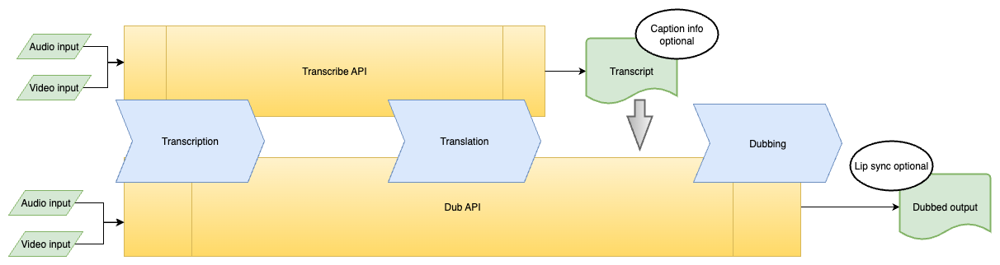

# How to transcribe and dub audio/video content

This guide explains the workflow for creating a video dub, which leverages Firefly's Transcribe and Dub APIs. Understand the use case for each API service and use this guide's quickstart commands to get started with your own implementation.

## Overview

When you create a dub from an audio or video file there are three main steps in the workflow: **transcription**, **translation**, and **dubbing**. Firefly's APIs are designed for specific tasks in this workflow.

|  |
|:--:|
| **Figure 1:** Workflow diagram showing the three main steps and featuring the Transcribe API and Dub API. |

Let's understand more about the design of each specific API.

### About the Dub API

The **Dub API** is the more comprehensive service and can perform all three steps in the workflow. It consumes input media and can perform the transcription, translation to a [target language](../../getting_started/usage/index.md#language-support), and dub, all at once. An optional AI lip sync is also available for the dubbed video.

This API also accepts transcripts as input, from Adobe's Transcript API or elsewhere, and can perform a dub using that transcript. Use edited transcripts in this way for more precise control over the final dub.

### About the Transcribe API

The **Transcribe API** converts speech from audio and video files into a text transcript which can be used as input for the Dub API. The output is a text file, and when captions are requested the response also includes an SRT file with caption information. Use the API to transcribe content in the source language or translate it into target languages, and generate captions.

This API can't re-translate a source transcript. A translation operation only occurs simultaneously with the transcription from the source media.

## Before you start

Use the quickstart commands below to get started implementing a workflow with these APIs. Try these cURL requests directly in your terminal. Or use an HTTP client like [Postman](https://www.postman.com/).

Prerequisites:

- You'll need a valid access token and client ID. See the [Authentication Guide](../../getting_started/index.md) for details.
- Upload your media files (audio or video) to [your storage location and generate a pre-signed URL](../../getting_started/storage_solutions/index.md).

## Transcribe quickstart

These are useful cURL commands to get started with the Transcribe API. In the commands below:

- Update the `Authorization` with the bearer access token.
- Update `x-api-key` with the client ID.
- Update `url` with the generated pre-signed URL for your input file.

### Transcribe video

```bash
curl --location 'https://audio-video-api.adobe.io/v1/transcribe' \
--header 'Authorization: Bearer <your_access_token>' \
--header 'Content-Type: application/json' \
--header 'x-api-key: <your_client_id>' \
--data '{
  "video": {
    "source": {
         "url" : "<your_presigned_url>"
    },
    "mediaType": "video/mp4"
  }
}'
```

### Transcribe audio

```bash
curl --location 'https://audio-video-api.adobe.io/v1/transcribe' \
--header 'Authorization: Bearer <your_access_token>' \
--header 'Content-Type: application/json' \
--header 'x-api-key: <your_client_id>' \
--data '{
  "audio": {
    "source": {
         "url" : "<your_presigned_url>"
    },
    "mediaType": "audio/mp3"
  }
}'
```

### Transcribe video with output in target language

```bash
curl --location 'https://audio-video-api.adobe.io/v1/transcribe' \
--header 'Authorization: Bearer <your_access_token>' \
--header 'Content-Type: application/json' \
--header 'x-api-key: <your_client_id>' \
--data '{
  "video": {
    "source": {
         "url" : "<your_presigned_url>"
    },
    "mediaType": "video/mp4"
  },
  "targetLocaleCodes": [
    "<your_target_locale_code>"
  ]
}'
```

### Transcribe audio with output in target language

```bash
curl --location 'https://audio-video-api.adobe.io/v1/transcribe' \
--header 'Authorization: Bearer <your_access_token>' \
--header 'Content-Type: application/json' \
--header 'x-api-key: <your_client_id>' \
--data '{
  "audio": {
    "source": {
         "url" : "<your_presigned_url>"
    },
    "mediaType": "audio/mp3"
  },
  "targetLocaleCodes": [
    "<your_target_locale_code>"
  ]
}'
```

### Captions from video

```bash
curl --location 'https://audio-video-api.adobe.io/v1/transcribe' \
--header 'Authorization: Bearer <your_access_token>' \
--header 'Content-Type: application/json' \
--header 'x-api-key: <your_client_id>' \
--data '{
  "video": {
    "source": {
         "url" : "<your_presigned_url>"
    },
    "mediaType": "video/mp4"
  },
  "captions": {
    "targetFormats": [
      "<your_target_caption_format>"
    ]
  }
}'
```

### Captions from audio

```bash
curl --location 'https://audio-video-api.adobe.io/v1/transcribe' \
--header 'Authorization: Bearer <your_access_token>' \
--header 'Content-Type: application/json' \
--header 'x-api-key: <your_client_id>' \
--data '{
  "audio": {
    "source": {
         "url" : "<your_presigned_url>"
    },
    "mediaType": "audio/mp3"
  },
  "captions": {
    "targetFormats": [
      "<your_target_caption_format>"
    ]
  }
}'
```

## Dub quickstart

Use these helpful cURL commands to get started with the Dub API. In the commands below:

- Update the `Authorization` with the bearer access token.
- Update `x-api-key` with the client ID.
- Update `url` with the generated pre-signed URL for your input file.

### Generate an automated dub

Pass `targetLocaleCodes` in these automated dub commands.

#### Automated dubbing for video

```bash
curl --location 'https://audio-video-api.adobe.io/v1/dub' \
--header 'Authorization: Bearer <your_access_token>' \
--header 'Content-Type: application/json' \
--header 'x-api-key: <your_client_id>' \
--data '{
  "video": {
    "source": {
        "url": "<your_presigned_url>"
    },
    "mediaType": "video/mp4"
  },
  "targetLocaleCodes": [
    "<your_target_locale_code>"
  ],
  "lipSync": "false"
}'
 ```

#### Automated dubbing for audio

```bash
curl --location 'https://audio-video-api.adobe.io/v1/dub' \
--header 'Authorization: Bearer <your_access_token>' \
--header 'Content-Type: application/json' \
--header 'x-api-key: <your_client_id>' \
--data '{
  "audio": {
    "source": {
        "url": "<your_presigned_url>"
      },
      "mediaType": "audio/mp3"
    },
    "targetLocaleCodes": [
      "<your_target_locale_code>"
    ],
    "lipSync": "false"
}'
```

### Dub from edited transcripts

Pass the `targetLocaleCodes` and edited transcripts in these commands for edited transcripts. The `transcripts` should contain **only one URL** for the edited transcript.

#### Dub from edited translations for video

```bash
curl --location 'https://audio-video-api.adobe.io/v1/dub' \
--header 'Authorization: Bearer <your_access_token>' \
--header 'Content-Type: application/json' \
--header 'x-api-key: <your_client_id>' \
--data '{
  "video": {
    "source": {
      "url": "<your_presigned_url>"
    },
    "mediaType": "video/mp4"
  },
  "transcripts": [
    {
      "source": {
        "url": "<your_transcript_presigned_url>"
      }
    }
  ],
  "targetLocaleCodes": [
    "<your_target_locale_code>"
  ],
  "lipSync": "false"
}'
```

#### Dub from edited translations for audio

```bash
curl --location 'https://audio-video-api.adobe.io/v1/dub' \
--header 'Authorization: Bearer <your_access_token>' \
--header 'Content-Type: application/json' \
--header 'x-api-key: <your_client_id>' \
--data '{
  "audio": {
    "source": {
      "url": "<your_presigned_url>"
    },
    "mediaType": "audio/mp3"
  },
  "transcripts": [
    {
      "source": {
        "url": "<your_transcript_presigned_url>"
      }
    }
  ],
  "targetLocaleCodes": [
    "<your_target_locale_code>"
  ],
  "lipSync": "false"
}'
```

## Check the result

Requests to these endpoints are processed asynchronously so a successful response returns a 202 status code with a job ID and a status URL.

**Example 202 response**

```bash
{
    "jobId": "986fc222-1118-4242-b326-eb9873e3982f",
    "statusUrl": "https://audio-video-api.adobe.io/v1/status/986fc222-1118-4242-b326-eb9873e3982f"
}
```

Use the job ID from the response with the [Get Result API](get_result_quickstart.md) to poll the job's status and retrieve the final results.

