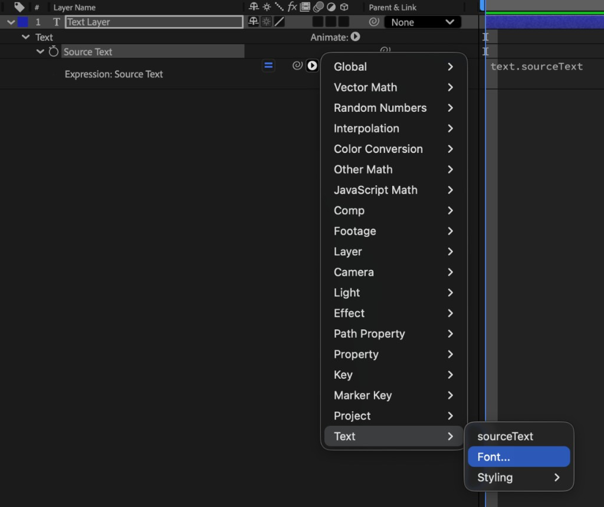

# Best practices for Dynamic Graphics Render and MOGRTs

Explore best practices and find answers to frequently asked questions about Firefly Services Dynamic Graphics Render API for Adobe After Effects Motion Graphics Templates.

## Who is this guide for?

This document is intended to help guide motion designers working in Adobe After Effects to create optimized Motion Graphic Templates (MOGRT) that are compatible with the Dynamic Graphics Render (DGR) API.

## What is Dynamic Graphics Render?

Dynamic Graphics Render (DGR) is an infinitely scalable service that renders data-driven After Effects templates using [Motion Graphics Templates](https://helpx.adobe.com/after-effects/using/creating-motion-graphics-templates.html) (MOGRT). The service reduces repetitive tasks required to produce and render video variations through automation and integrations in production and marketing supply chains.

Driven by a structured data set that represents the changeable parameters defined in After Effects (like CSV or JSON), the service concurrently renders each video and returns the output to your designated cloud location (for example, Frame.io or a signed URL location).

### What can DGR be used for?

DGR can be used to render any MOGRT at scale. Typical use cases include:

Rendering videos that are optimized for various:

- target audiences,
- consumption devices, and
- social platforms.

Rendering a high volume of:

- video with different text,
- images, and
- video and audio for advertising and performance marketing.

### How are MOGRTs created?

MOGRTs are created in Adobe After Effects, where designers can composite animation, graphics, video and audio on a timeline. After Effects is an industry-leading creative tool typically used to produce onscreen graphics, 2D and 3D animation that represent and maintain a brand's look and feel.

### Why use MOGRTs?

MOGRTs are an intermediate format that package a specific After Effects composition and its associated assets into a single, easily distributable file, and define user-editable properties to ensure brand compliance.

DGR uses MOGRTs to process After Effects compositions for scaled rendering.

### Core capabilities of DGR

DGR capabilities include (but are not limited to) text replacement, image and video replacement, and audio replacement, which is a feature not available in standard MOGRT workflows.

Motion designers can design templates in After Effects and export them as `.mogrt` files. The DGR API is able to recognize the exposed Essential Properties controls for data insertion. By providing a dataset to populate these controls, users can generate hundreds or thousands of video variations without manually updating the template in After Effects or Premiere.

End users don't need to have After Effects or Premiere experience. If a user can fill out a spreadsheet or complete an online form, they're able to generate videos with Dynamic Graphics Render.

## Tips for preparing your After Effects project for DGR-ready MOGRTs

These tips will help you prepare your MOGRTs to be DGR-ready.

**Design templates for a fixed duration:**

In Adobe Premiere Pro, MOGRTs can be created with protected regions, allowing a user to adjust the duration of the template.

These adjustable duration compositions are **not** currently supported by DGR. Videos rendered with DGR are always the same duration as the composition from which the MOGRT was created.

**Create separate templates for different aspect ratios and durations:**

When creating videos for multiple aspect ratios (for example, 9:16 portrait; 16:9 landscape), a separate MOGRT should be created for each.

Likewise, if templates of different durations are required, these should be created as separate MOGRTs.

**Give properties unique names in the Essential Graphics panel:**

To avoid any potential conflicts in the API, it's recommended to ensure that all properties (controls) in the Essential Graphics panel have unique names, even if you're separating similar controls into groups.

For example, if you have a "Text" property in both an "Intro" and an "Outro" group, consider naming the properties "Intro Text" and "Outro Text".

**Pre-render where possible:**

It can often be beneficial to pre-render the parts of your composition that won't change, or that won't interact with any customizable elements. This reduces the processing requirements when rendering, for a faster output.

**Real-time feedback is not available via DGR – plan your MOGRT controls accordingly:**

When using MOGRTs in Adobe Premiere Pro, users can see the template update in real time when control values are changed. As the DGR API runs as a headless service, this real-time feedback is not available. Plan your controls with this limitation in mind.

For example, rather than using a Slider control to adjust the position of a layer, consider using a Dropdown Menu control to limit the position to a few pre-defined options.

**Avoid third-party effects and plug-ins:**

It's not currently possible to install third-party effects or plug-ins. Please avoid using these in your templates. If third-party effects or plug-ins are used, your DGR exports may fail, or may not render as expected.

**Use the Classic 3D renderer:**

If your template includes 3D layers, ensure all relevant compositions are using the Classic 3D renderer. The Advanced 3D and Cinema 4D renderers are not supported by MOGRTs or DGR.

In Adobe After Effects, you can change the renderer in the 3D Renderer tab in the Composition Settings dialog box.

**Include safeguards for safe areas:**

If designing for formats that recommend keeping elements within safe areas (for example, to avoid cut-off in TV broadcasts, or to avoid elements being placed underneath the UI in apps like Instagram or TikTok), be aware that dynamic content might extend beyond the planned area. This is most likely with Text layers set to Point text.

It can be helpful to add expressions to limit or adjust the size or position of your layers to automatically keep them within the safe areas, for example, by [using copyfit expressions](#copyfit-text-fitting) to scale down a text layer if its content exceeds a specified width.

Recommended safe area guidelines can generally be found on the platform's website or provided by your team's contact at the relevant organization.

## Video replacement

When assigning a layer as a Media Replacement property in the Essential Properties panel, be sure to set the Scale option to match the desired Scale to fill, Scale to fit, Stretch to fill, or No scale outcome.

There is no limit on individual file size. However, the combined size of assets that can be replaced is capped at 5 GB.

- **Resolution:** Up to 3840 x 2160 pixels
- **Frame rate:** Up to 60 FPS

<InlineAlert variant="info" slots="heading, text" />

Note

If a replacement video is shorter than the duration of the layer that it is replacing, the last frame of the replacement video will be held until the end of the video layer's duration.

## Image replacement

When assigning a layer as a Media Replacement property in the Essential Properties panel, be sure to set the Scale option to match the desired Scale to fill, Scale to fit, Stretch to fill, or No scale outcome.

We support the file types described in the [API reference](../../api/index.md) and job responses when validation fails, with no limit on individual file size. However, the combined size of assets that can be replaced is capped at 5 GB.

- **Resolution:** Up to 3840 x 2160 pixels

## Audio replacement (Global Audio Replacement)

There is no need to set this up in After Effects (the Essential Graphics panel currently doesn't support audio replacement).

Currently, only one audio track is replaceable, with the following options:

- All existing audio is removed from the template, and the new audio file is inserted.
- Existing audio is retained, and the new audio is added to it.

Replacement audio tracks will always play from the start of the composition until the end of the composition, or from the end of the audio track if the audio track has a shorter duration.

Audio processing features, like volume adjustment or ducking, are not available. If audio needs processing, like retiming to fit with the video timing, this should be done in an application like Adobe Audition before uploading to your media server.

We support the file types described in the [API reference](../../api/index.md) and job responses when validation fails, with no limit on individual file size. However, the combined size of assets that can be replaced is capped at 5 GB.

## Data replacement

Data files (like CSV, TSV, or JSON files) can be included in After Effects projects to [drive animations or populate property values](https://helpx.adobe.com/after-effects/using/data-driven-animations.html). DGR supports MOGRTs that include and reference data files. It's recommended that any data files referenced in your project are added as a layer within a composition.

However, DGR does not currently support Media Replacement of data files.

## Font replacement

When calling the DGR API, fonts can be replaced by referring to a font's PostScript name. Any fonts used in the MOGRT should be delivered with the `.mogrt` file, as they will need to be supplied to the API service. Users are expected to have valid licenses for all fonts used.

Font replacement is also possible via expressions. References to fonts in expressions must match the font's PostScript name.

<InlineAlert variant="info" slots="heading, text" />

Tip

You can find a font's PostScript name in After Effects by opening the Expression language menu on any property and selecting **Text** > **Font…**. After you select a font and press **OK**, the PostScript name will be inserted into the expression.



## Text sizing

The native font size properties available to MOGRTs are not available to the Dynamic Graphics Render API.

Two alternatives exist:

- Font sizes can be defined in expressions (and controlled by an exposed Slider or Dropdown control).
- The Scale property of text layers can be exposed (or a Slider linked to this Scale property).

## Copyfit (Text fitting)

Copyfitting is not an inherent feature of DGR, MOGRTs, or After Effects.

Expressions can be added to layers to scale text to fit within specific boundaries, or to reposition based on the position or size of other layers in the comp.

## Support for expressions

Expressions are a fundamental part of layer properties and are respected in Dynamic Graphics Render. However, due to the vast range of possible expressions, there may be edge cases that are not supported.

The API supports an English environment. If you're designing in a non-English language version of After Effects, it's important to universalize expressions to avoid errors. When referencing other properties, you can use Matchnames or indices.

Alternatively, you can use third-party tools such as [ExpressionUniversalizer](https://aescripts.com/expressionuniversalizer/) to convert existing expressions to language-agnostic expressions.

DGR is currently compatible with MOGRTs created in After Effects 2025 or earlier. Avoid using any expressions that were added to After Effects after this version. You can [check the changelog for expressions](https://ae-expressions.docsforadobe.dev/introduction/changelog/).

<InlineAlert variant="info" slots="heading, text" />

Tip

When pickwhipping to reference an effect's property in your expression, hold the Alt/Option (Windows/macOS) key to reference the property by index, rather than by name.

Watch out for processing-heavy expressions like `sourceRectAtTime()`. When used without a time parameter, the results are calculated for every frame. When using a time parameter (for example, `sourceRectAtTime(0)`) the results are calculated for the defined frame only.

## Support for Expression Control effects

The following Expression Control effects are currently supported by the DGR API:

- **Slider**
- **Dropdown Menu**
- **Checkbox**

### Slider

Value expected by the API: floating-point value.

<InlineAlert variant="info" slots="heading, text" />

Note

The DGR API will limit (clamp) values for this control to the range that you specify within the Essential Graphics panel. Be sure to set a large enough range for any value you might expect a user to input.

### Dropdown Menu

Value expected by the API: array index (0-index).

<InlineAlert variant="info" slots="heading, text" />

Note

This control is 1-indexed within After Effects. Keep this difference in mind when writing any accompanying documentation.

### Checkbox

Value expected by the API: `true` or `false`.

The following Expression Control effects are **not** currently supported by the DGR API:

- Angle
- Point
- 3D Point
- Color
- Layer

You can use one or more Slider effects in place of Angle, Point, and 3D Point, with appropriately defined ranges of values.

### Color

Add a text layer to your comp (hidden or set as a guide layer) and add its Text Source as an Essential Property. You can link Color properties to this Text Source property, using the following expression, to convert text-based Hex color values to RGBA color.

```javascript
const hexString = thisComp.layer("Color Value").text.sourceText.value;
hexToRgb(hexString);
```

### Layer

You can use a Slider effect in place of this, referring to layers by index.

Alternatively, you can use a Dropdown Menu effect. However, the menu must be manually populated; it will not auto-update when you rename, move, add, or delete layers.

## MOGRT export

DGR is currently compatible with MOGRTs created in After Effects 2025 or earlier.

If you have created your After Effects project in a later version:

1. Save to a version compatible with After Effects 2025 via **File** > **Save As…** > **Save a Copy As 25.x…**.
2. Then open that file in After Effects 2025 and export the MOGRT from the Essential Graphics panel.

It's recommended to disable the **Include video preview** option to significantly reduce the size of the `.mogrt` file.

## MOGRT guide and handover

After exporting your MOGRT templates, it can be helpful to provide an accompanying guide to help your team's engineers set up the API interaction correctly. This guide can include:

- The type and range of values that each control should expect.
- A relevant description of each control.

It can also be helpful to specify the pixel dimensions and duration of the exported composition.

Also note that Dropdown Menu controls are 1-indexed when referenced in expressions (that is, the first option has an internal value of 1). However, the DGR API interprets Dropdown Menu controls as 0-indexed. Your accompanying guide should reflect this. For example, a Dropdown Menu control with three items could be listed as:

- `0`: Apple
- `1`: Banana
- `2`: Cherry

Any comments or groups in the Essential Graphics panel are currently not readable by the API, so don't rely on these as instructions to the end user.

### Suggested package contents

- `.mogrt` file
- Font files
- Accompanying guide
- Sample media files for testing (if testing is required)

## DGR export profiles

The output video render profiles that we support are:

- **Resolution:** Up to 3840 x 2160 pixels.
- **Frame rate:** Up to 60 FPS.

**Popular video codec support:**

- H.264, `.mp4` format
- ProRes (with alpha support), `.mov` and `.mxf` formats
- Apple ProRes 4444 XQ
- Apple ProRes 4444
- Apple ProRes 422 HQ
- Apple ProRes 422
- Apple ProRes 422 LT
- Apple ProRes 422 Proxy

**Popular audio codec support:** See encoder presets and your export requirements.

## DGR Encoder Presets

The following preset IDs are available through the [Presets API](index.md). For request and response examples, see [the sample request](index.md#sample-request) on the same page. Expand an item to see the encoder settings JSON for that preset.

<AccordionItem slots="heading, text, code" />

### `ffs_video_api_land_1080p_hq` — Landscape 1920×1080 – High Quality

Encoder settings:

```json
{
  "mediaType": "video/mp4",
  "codec": "H.264",
  "maxFps": {
    "numerator": 30,
    "denominator": 1
  },
  "bitrateMode": "vbr",
  "targetBitrateInKbps": 8000,
  "maxBitrateInKbps": 12000,
  "alpha": false
}
```

<AccordionItem slots="heading, text, code" />

### `ffs_video_api_land_1080p_lq` — Landscape 1920×1080 – Low Quality

Encoder settings:

```json
{
  "mediaType": "video/mp4",
  "codec": "H.264",
  "maxFps": {
    "numerator": 30,
    "denominator": 1
  },
  "bitrateMode": "vbr",
  "targetBitrateInKbps": 6000,
  "maxBitrateInKbps": 8000,
  "alpha": false
}
```

<AccordionItem slots="heading, text, code" />

### `ffs_video_api_square_1080p_hq` — Square 1080×1080 – High Quality

Encoder settings:

```json
{
  "mediaType": "video/mp4",
  "codec": "H.264",
  "maxFps": {
    "numerator": 30,
    "denominator": 1
  },
  "bitrateMode": "vbr",
  "targetBitrateInKbps": 6000,
  "maxBitrateInKbps": 8000,
  "alpha": false
}
```

<AccordionItem slots="heading, text, code" />

### `ffs_video_api_square_1080p_lq` — Square 1080×1080 – Low Quality

Encoder settings:

```json
{
  "mediaType": "video/mp4",
  "codec": "H.264",
  "maxFps": {
    "numerator": 30,
    "denominator": 1
  },
  "bitrateMode": "vbr",
  "targetBitrateInKbps": 3000,
  "maxBitrateInKbps": 4000,
  "alpha": false
}
```

<AccordionItem slots="heading, text, code" />

### `ffs_video_api_vert_1920p_hq` — Vertical 1080×1920 – High Quality

Encoder settings:

```json
{
  "mediaType": "video/mp4",
  "codec": "H.264",
  "profile": "high",
  "maxFps": {
    "numerator": 30,
    "denominator": 1
  },
  "bitrateMode": "vbr",
  "targetBitrateInKbps": 6000,
  "maxBitrateInKbps": 8000,
  "alpha": false
}
```

<AccordionItem slots="heading, text, code" />

### `ffs_video_api_vert_1920p_lq` — Vertical 1080×1920 – Low Quality

Encoder settings:

```json
{
  "mediaType": "video/mp4",
  "codec": "H.264",
  "profile": "high",
  "maxFps": {
    "numerator": 30,
    "denominator": 1
  },
  "bitrateMode": "vbr",
  "targetBitrateInKbps": 3000,
  "maxBitrateInKbps": 4000,
  "alpha": false
}
```

<AccordionItem slots="heading, text, code" />

### `ffs_video_api_prores` — ProRes export preset supporting alpha channel

Encoder settings:

```json
{
  "mediaType": "video/quicktime",
  "codec": "Apple ProRes 4444",
  "profile": "high",
  "maxFps": {
    "numerator": 30,
    "denominator": 1
  },
  "bitrateMode": "vbr",
  "alpha": true
}
```

We support [predefined social presets](index.md#sample-request) or a custom preset (or `.epr` files). `.epr` files are exported custom presets from Adobe Media Encoder.

## See also

- [WKND Product Showcase sample MOGRT package](dgr-sample-mogrt-wknd.md)
- [Using the Presets API](index.md)
- [Using the Describe API](dgr-describe.md)
- [Using the Render API](dgr-render.md)
- [Authentication and setup](../../getting-started/index.md)
- [Technical usage notes](../../getting-started/usage/index.md)
