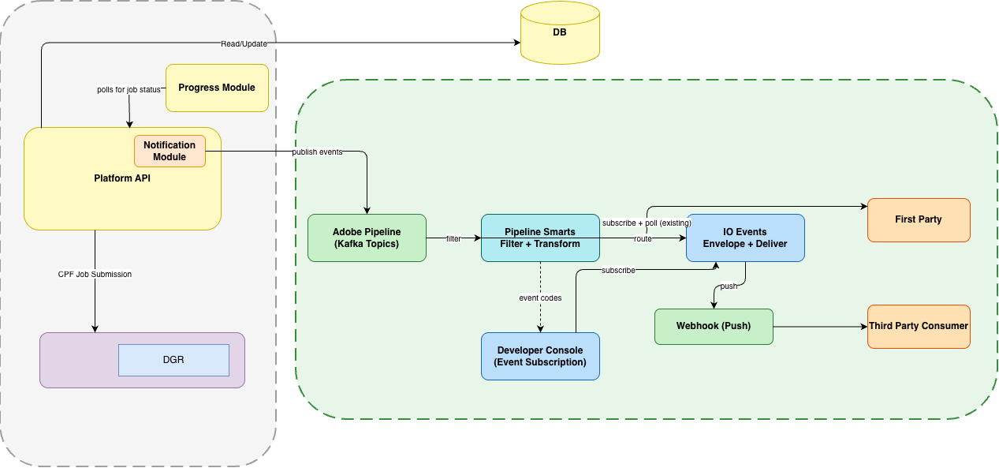

# Setting up Dynamic Graphics Render API events with Adobe I/O Events

These instructions describe how to set up and use [Adobe I/O Events](https://developer.adobe.com/events/docs/) for Dynamic Graphics Render (DGR) job notifications. You can stream render job lifecycle updates to your own infrastructure instead of relying only on polling the status URL returned by the [Render API](dgr-render.md).

## Introduction

DGR follows an asynchronous job model. After you start a render job, you can [poll the Get Status API](dgr-render.md#get-status-api-render-job) for completion and output URLs. Adobe I/O Events complements that pattern by delivering **near real-time** notifications to a webhook you register in Adobe Developer Console, using the [CloudEvents](https://cloudevents.io/) specification.

This guide focuses on **third-party (external) integrations** that use Adobe Developer Console, OAuth credentials, and an HTTPS webhook. Adobe internal services may use different integration paths on Adobe's network.

## How notifications work

When a render job reaches certain lifecycle points, the service emits events that are routed through Adobe's event pipeline. A filtering and transformation layer ensures that only events relevant to your **IMS organization** are forwarded. [Adobe I/O Events](https://developer.adobe.com/events/docs/) wraps those events in a **CloudEvents 1.0** envelope and delivers them to your subscription.

For webhooks, Adobe recommends **batch** delivery when your use case allows it, so your endpoint can process multiple notifications per request (see the [InDesign APIs events setup guide](https://developer.adobe.com/events/docs/guides/using/indesign-apis/indesign-apis-events-data-stream-setup) for similar guidance).

## Delivery model

The following diagram shows how render job activity flows from the Audio/Video platform through Adobe's pipeline, Developer Console subscriptions, and Adobe I/O Events to **first-party** consumers (subscribe and poll) and **third-party** consumers (webhook push).



At a high level:

1. The platform tracks render jobs and **publishes** lifecycle events into Adobe's event backbone.
2. **Filtering and transformation** scope events (for example by organization) before downstream delivery.
3. **Adobe Developer Console** lists the event types you can subscribe to for Dynamic Graphics Render.
4. **Adobe I/O Events** envelopes the payload and **delivers** it: first-party integrations can subscribe and poll; third-party integrations typically register an **HTTPS webhook** to receive pushes.

## Setup Adobe I/O

Start with [Getting Started with Adobe I/O Events](https://developer.adobe.com/events/docs/). The steps below mirror other Firefly Services APIs (for example [InDesign APIs - Firefly Services events](https://developer.adobe.com/events/docs/guides/using/indesign-apis/indesign-apis-events-data-stream-setup)), adapted for Dynamic Graphics Render.

Open [Adobe Developer Console](https://developer.adobe.com/console/) and sign in. When prompted, use the actions in the Console UI to proceed.

1. Select **Create new project** (or open an existing project where you want to add the subscription).
2. Select **Add** for **Events** (or **Add to Project** and choose **Event**).
3. Under **Configure event registration**, filter providers by **Creative Cloud** (or the filter your team uses for Firefly Services event providers).
4. Select the Dynamic Graphics Render provider: **`{DGR_EVENTS_PROVIDER_NAME}`** (replace with the exact label shown in Console once your team publishes it).
5. Subscribe to the event types your application needs: **`{LIST_OF_EVENT_TYPES}`** (replace with the codes listed for that provider in Console).
6. Add **OAuth Server-to-Server** credentials to the project if you have not already. This credential type uses the OAuth 2.0 `client_credentials` grant to obtain access tokens for API calls.
7. Complete **Event registration**: provide a name and description for this subscription.
8. Under **Configure event registration**, choose delivery:
   - **Webhook** — Provide a **public HTTPS** URL. The endpoint must respond correctly to Adobe's **GET** challenge (return the `challenge` query parameter when present) and acknowledge **POST** deliveries so Adobe I/O Events does not disable the webhook after retries.
   - **Runtime action** — Alternatively, forward events to [Adobe I/O Runtime](https://developer.adobe.com/runtime/docs/guides/getting-started/). Select a namespace and action as described in Runtime documentation.
9. Save the registration and confirm the status is **Active**. If you chose a webhook, confirm it passed the challenge without errors.

<InlineAlert variant="info" slots="heading, text" />

Provider and event type names

Replace `{DGR_EVENTS_PROVIDER_NAME}` and `{LIST_OF_EVENT_TYPES}` with the values your engineering or program team supplies. They must match what appears in Adobe Developer Console for your organization.

## Event data structure

Events are JSON and follow the [CloudEvents 1.0](https://github.com/cloudevents/spec/blob/v1.0.2/cloudevents/spec.md) shape. Field names and nested payloads **may vary** by release; treat the examples below as illustrative until you capture a live delivery from your subscription.

Third-party webhook payloads are **sanitized** and typically include only job identification, high-level status, and a URL you can use to fetch full job details (for example the same status URL returned when you started the render job). Confirm exact property names (`job_id` vs `jobId`, and so on) with your engineering contact.

### Example event (single)

```json
{
  "data": {
    "key": "a1b2c3d4-e5f6-7890-abcd-ef1234567890",
    "source": "dynamic-graphics-render",
    "value": {
      "job_id": "ff7b0f8e-47f3-4d8f-9a8b-7a9f9b2f4c42",
      "status": "succeeded",
      "status_url": "https://audio-video-api.adobe.io/v1/status/ff7b0f8e-47f3-4d8f-9a8b-7a9f9b2f4c42"
    }
  },
  "id": "b2c3d4e5-f6a7-8901-bcde-f12345678901",
  "source": "urn:uuid:00000000-0000-4000-8000-000000000001",
  "specversion": "1.0",
  "type": "{DGR_EVENT_TYPE_EXAMPLE}",
  "datacontenttype": "application/json",
  "time": "2026-05-13T12:00:00.000Z",
  "eventid": "c3d4e5f6-a7b8-9012-cdef-123456789012",
  "recipientclientid": "<your_console_client_id>"
}
```

### Example event (batch)

When batch delivery is enabled, your webhook may receive an array of CloudEvents objects in one POST body.

```json
[
  {
    "data": {
      "key": "d4e5f6a7-b8c9-0123-def0-234567890123",
      "source": "dynamic-graphics-render",
      "value": {
        "job_id": "ff7b0f8e-47f3-4d8f-9a8b-7a9f9b2f4c42",
        "status": "running",
        "status_url": "https://audio-video-api.adobe.io/v1/status/ff7b0f8e-47f3-4d8f-9a8b-7a9f9b2f4c42"
      }
    },
    "id": "e5f6a7b8-c9d0-1234-ef01-345678901234",
    "source": "urn:uuid:00000000-0000-4000-8000-000000000001",
    "specversion": "1.0",
    "type": "{DGR_EVENT_TYPE_EXAMPLE}",
    "datacontenttype": "application/json",
    "time": "2026-05-13T12:00:01.000Z",
    "eventid": "f6a7b8c9-d0e1-2345-f012-456789012345",
    "recipientclientid": "<your_console_client_id>"
  }
]
```

### Field reference

| Field | Description |
| --- | --- |
| `eventid` | Unique identifier for the delivery (Adobe I/O Events). |
| `id` | Unique identifier for the CloudEvent instance. |
| `type` | Event type string; used for routing and subscription matching. |
| `source` | Context in which the event occurred (URN or identifier from the provider). |
| `time` | Timestamp for the event. |
| `data` | Wrapper for provider-specific payload. |
| `data.key` | Often mirrors a per-event key used for tracing or deduplication. |
| `data.source` | Product or service identifier for the inner payload. |
| `data.value` | Sanitized job fields (for example job id, status, status URL). |
| `recipientclientid` | Your Adobe Developer Console OAuth client ID receiving the event. |

## Event types available for subscription

<InlineAlert variant="info" slots="heading, text" />

Event codes in Console

The authoritative list of Dynamic Graphics Render event types is the set shown when you configure the event provider in **Adobe Developer Console**. Event names and payloads can evolve; always verify the current options in Console before you go to production.

## End-to-end checklist

Use this checklist to validate your integration.

1. **Project and credentials** — Create or reuse an Adobe Developer Console project with **OAuth Server-to-Server** credentials and note the `client_id` (API key) and secret for token requests.
2. **Event registration** — Add **Events**, select **`{DGR_EVENTS_PROVIDER_NAME}`**, choose **`{LIST_OF_EVENT_TYPES}`**, and complete registration with **Webhook** or **Runtime** delivery.
3. **Webhook** — Use a public HTTPS test or staging endpoint that implements the GET challenge and acknowledges POST bodies. Register that URL in the event registration.
4. **Verify activation** — Confirm registration status is **Active** and the webhook challenge succeeded.
5. **Call the Render API** — Use the same Console application's credentials as for other Audio/Video API calls. Submit a render job per [Using the Render API](dgr-render.md) (`POST https://audio-video-api.adobe.io/v1/templates/render` with valid bearer token and `x-api-key`).
6. **Confirm delivery** — Observe incoming CloudEvents at your webhook when the job transitions through subscribed lifecycle points. Use the `status_url` (or equivalent) in the payload to reconcile with [Get Status](dgr-render.md#get-status-api-render-job) if needed.

## Related guides

- [Using the Render API](dgr-render.md)
- [Using the Describe API](dgr-describe.md)
- [Quickstart for Presets with the Dynamic Graphics Render API](index.md)
- [Getting Started with the Audio/Video API](../../getting-started/index.md)

## See also

- [Getting Started with Adobe I/O Events](https://developer.adobe.com/events/docs/)
- [Setting up InDesign APIs User Events Stream with Adobe I/O Events](https://developer.adobe.com/events/docs/guides/using/indesign-apis/indesign-apis-events-data-stream-setup) (similar Console flow for another Firefly Services API)
