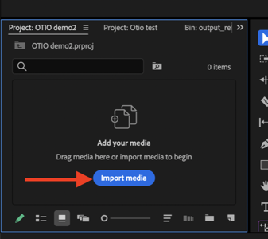
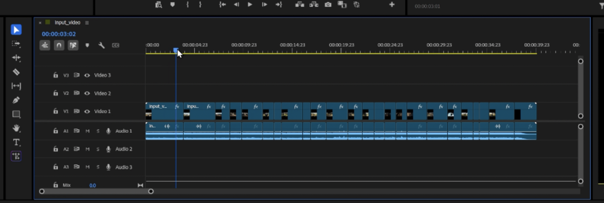

# Reframe with OTIO files

This guide explains how to use OTIO files from the Reframe v2 API to adjust reframing in Premiere Pro.

## Overview

The Reframe v2 API sidecar supports OTIO files, which are also supported in Premiere Pro 25.6.0 or above.
[Open Timeline IO format (OTIO)](https://opentimelineio.readthedocs.io/en/latest/tutorials/otio-file-format-specification.html) is an interchange format for video editing information.
OTIO contains information about the order and length of cuts and references to external media.

With the `.otio` sidecar format, users get the maximum reframe flexibility for specific shots, leveraging scene edit detection cuts (in the set aspect ratio) in a timeline that's not destructive to the source file. This allows for quick and easy adjustments to the reframe of specific shots.

## Making adjustments in Premiere Pro

To make adjustments using the `.otio` file in Premiere Pro:

1. Import the `.otio` file. Do this by finding the file locally using **File > Import** (&#8984;+I on Mac), using the **Import Media** button in the *Project* panel, double clicking an empty place in the *Project* panel, or drag and drop the `.otio` file into the *Project* panel. Importing an `.otio` file will add a sequence and source file reference in the *Project* panel.

1. Open the video sequence by double clicking on the video thumbnail. The source file will open in the *Timeline* panel, showing cuts at each point where a new scene is detected. This allows corrections to the duration of a specific shot.

1. To playback the video, position the blue play head at the start of the timeline and press **spacebar** to play. Pressing **spacebar** again pauses playback. Using play and pause, the blue line of the play head shows the underlying clip range that a user may adjust with the reframe.

1. Find the clip that needs an adjustment and open the *Effect Controls* panel to see the selected clip's parameters and effects list. The `.otio` file has added the *Auto Reframe* effect and created key frames.

1. Use the *Reframe Offset* option to adjust the offset (the X-position) of the area of interest, while keeping the tracking key frames.
